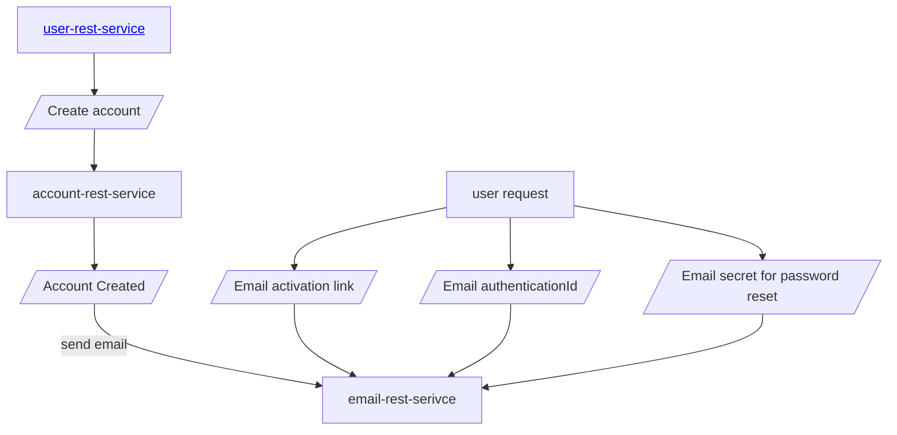

# email-rest-service

 
This is a Email Rest Service api built using Spring WebFlux. 
This is a reactive Java webservice api and exposes a Rest api for sending email.

This uses [token-filter](https://github.com/sonamsamdupkhangsar/token-filter) gradle project for creating JwtDecoder with custom IssuerUrl.

## How is this service used?


## Run locally

## Run locally using profile
Use the following to run local profile which will pick up properties defined in the `application-local.yml` :

```
gradle bootRun --args="--spring.profiles.active=local"
```
 
## Build Docker image

Build docker image using included Dockerfile.
`docker build -t imageregistry/email-rest-service:1.0 .` 

## Push Docker image to repository
`docker push imageregistry/email-rest-service:1.0`

## Deploy Docker image locally
`docker run -e EMAIL_HOST=<HOST> -e EMAIL_PORT=<PORT> \
 -e EMAIL_USERNAME=<EMAIL> -e EMAIL_PASSWORD=<PASSWORD> \
 --publish 8080:8080 imageregistry/email-rest-service:1.0`

Test email api locally using `curl`:

````
 curl -X POST http://localhost:8080/email -H 'Content-Type: application/json' \
 -d '{"from": "from@my.email", "to": "to@my.email", \
  "subject":"hello", "body": "welcome to planet Earth"}'
 ```` 
Test email on host using `curl`:
```
curl https://email-rest-service.sonam.cloud/email -H "Authorization: Bearer $JWT" \
  -H "Content-Type: application/json" -X POST \
 -d '{"from": "from@my.email", "to": "to@my.email", "subject":"hello", "body": "welcome to planet Earth"}'
  ```
## Installation on Kubernetes
Use a Helm chart such as my one here @ [sonam-helm-chart](https://github.com/sonamsamdupkhangsar/sonam-helm-chart):

```helm install emailapi sonam/mychart -f values.yaml --version 0.1.11 --namespace=backend```

